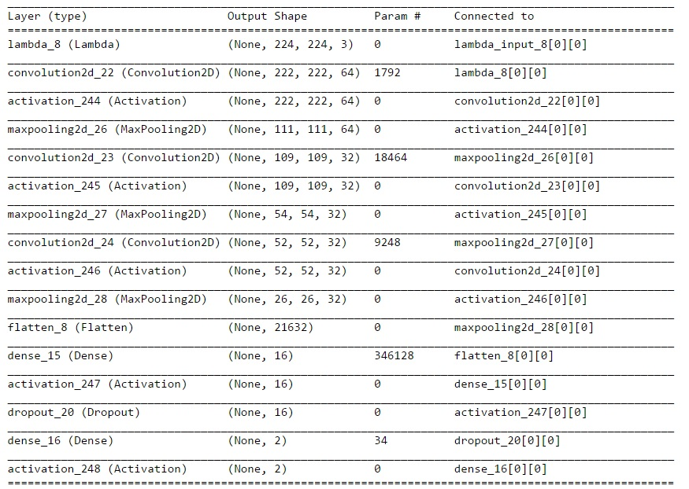
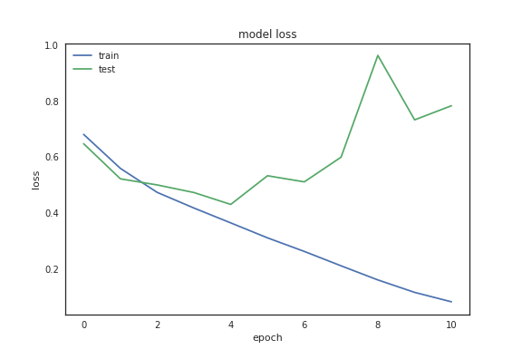
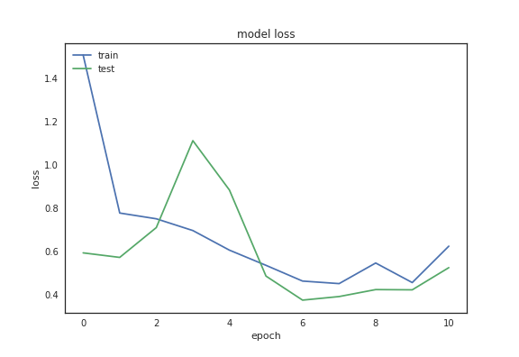
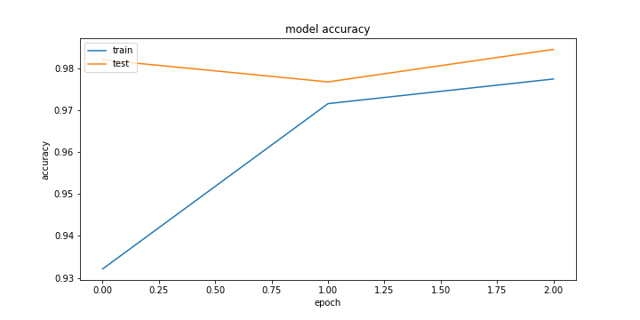
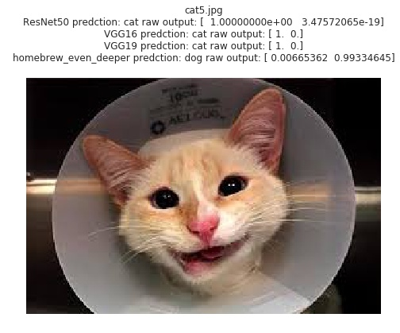

# Dog Vs Cat: A Deep Convolutional Neural Network Based Dog/Cat Classifier

---
 *

### 项目概览
使用深度学习方法识别一张图片是猫还是狗。

* 输入：一张彩色图片
* 输出：是🐈还是🐩
* 数据集: 来自Kaggle [Dogs vs. Cats Redux: Kernels Edition](https://www.kaggle.com/c/dogs-vs-cats-redux-kernels-edition) 的已标记的🐱/🐶图片

### 问题说明
以彩色图片作为输入，训练适用于区分猫狗图像的分类模型。已有大量研究证明深度卷积神经网络([Convolutional Neural Network](https://en.wikipedia.org/wiki/Convolutional_neural_network))是解决这类问题的非常有效的方法[[1](https://arxiv.org/abs/1409.1556), [2](https://papers.nips.cc/paper/4824-imagenet-classification-with-deep-convolutional-neural-networks.pdf), [3](http://papers.nips.cc/paper/4824-imagenet-classification-with-deep-convolutional-neural-networks)]。因此，在本项目中也将采用类似的模型搭建卷积神经网络并进行训练和测试。

模型搭建将采用两种方式：
 
 1. homebrew model: 从头搭建一个卷积网络
 2. stand on the shoulders of giants: 充分利用现存的已经经过实战检验的预训练过的模型，在此基础之上添加相应的结构获得希望的输出
 
### 模型评价指标 
本项目中训练获得的模型将以区分猫狗的正确率(accuracy)做为评价标准。其中测试集的来源主要有两个部分: 一部分来自从原始数据集保留的部分没有用于训练的图片，按照业界通行的标准计算正确率。另一部分来自从互联网中获取的部分图片，用于对给予感性的理解。

### 数据研究
在建立模型前，首先对训练数据进行分析以获取数据的特性。

* 原始数据集中共有25000张已标记的图片，其中猫/狗图片各12500张，数目相当，因此不存在训练样本数量不均衡所导致的模型偏差。
* 原始数据集中图片的尺寸分布如图所示。可以看出图片的尺寸并不一致，无法直接作为模型的输入，需要进行尺寸的归一化处理。

* 人工查看了部分图片，发现训练集已经包括了多种不同背景，光照条件，动物姿态，颜色等的图片。作为一个二分类问题，我认为现有的数据集已足够模型使用，不需要进行进一步的data augmentation.
* 原始图片是通过文件名中的"dog"或者"cat"来标记🐶/🐱的，为方便之后模型的训练，这里采用了one-hot encoding的方法来将标记转换为2维的向量。

### 模型建立
1. homebrew model:
	使用keras建立具有三层Convolutional Layer的模型，输入为(200, 200, 3)的图片, 输出为2维向量。模型的具体结构如下图所示。。
	
2.  stand on the shoulders of giants: 
    将带有预训练权重的ImageNet图像分类模型模型前端与自定的模型后端进行连接建立用于本项目的模型。这里主要使用了[VGG16, VGG19, ResNet](https://keras.io/applications/)模型前端, 并冻结其权重来进行特征提取，之后加入自定的几个全连接层用于本项目中的图片分类。

### 模型训练与评估
因所需的计算量较大, 本项目的模型训练使用了AWS p2.xlarge instance, 并参考了[这篇文档](http://discussions.youdaxue.com/t/aws/30961)进行了配置。关于数据预处理,可视化和模型搭建的代码可以参阅这个[Jupyter Notebook](./DogVsCatFlowSetup.ipynb)。
原始训练数据按照8:2的比例划分为训练验证集和测试集，之后训练验证集同样按照8:2的比例划分为训练集和验证集。
经过尝试发现，对于hombrew model使用6个epoch训练，而对于采用带有预训练权重的model使用3个epoch训练就可以达到比较好的效果。模型训练中loss和accuracy随epoch变化的曲线罗列如下:

* **homebrew model**
    * loss 

    * accuracy (final accuracy = 0.80)

* **VGG16 model**
    * loss

    * accuracy (final accuracy = 0.97)

* **VGG19 model**
    * loss

    * accuracy (final accuracy = 0.95)

* **ResNet model**
    * loss

    * accuracy (final accuracy = 0.99)

经过训练，homebrew model的accuracy达到了80%以上，采用带有预训练权重的model的accuracy均在95%以上。 

同时，为对模型的实际预测能力有一个直观的认识，我们从也通过搜索引擎从互联网上获取了一些图片用于测试，以下是部分测试结果。测试代码可以参阅这个[Jupyter Notebook](./DogVsCatModelPrediction.ipynb)

可以看出采用带有预训练权重的model的表现十分出色，对所有的测试图片都给出了正确的预测结果。而homebrew model在cat4和cat5图片上给出了错误的结果。因为homebrew model的结构相对简单，这一结果也并没有出乎意料。

### 总结
在本项目中，我们使用了深度学习的方法来处理猫狗图片分类的问题，采用两种不同的路径搭建,训练并验证了CNN模型，最终都获得了较高的识别率(>80%)。相较而言，homebrew model还存在有较大的
的改进空间，需要在今后继续研究。

 

##### * title image source: https://www.pinterest.com/pin/365636063472803484/

