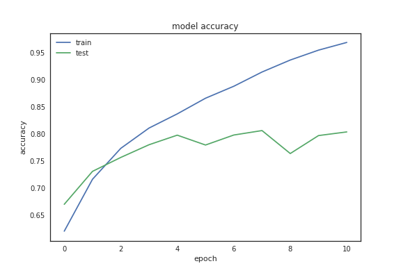
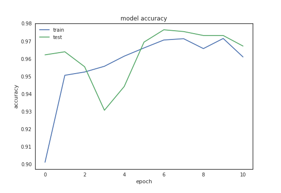
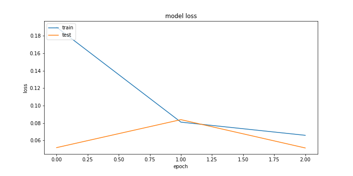
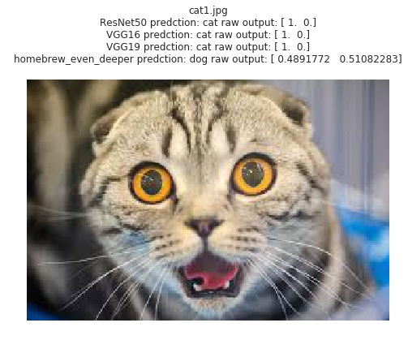

# Dog Vs Cat: A Convolutional Neural Network Based Dog/Cat Classifier

---
 *

### 项目概览
使用深度学习方法识别一张图片是猫还是狗。

* 输入：一张彩色图片
* 输出：是🐈还是🐩
* 数据集: 来自Kaggle [Dogs vs. Cats Redux: Kernels Edition](https://www.kaggle.com/c/dogs-vs-cats-redux-kernels-edition) 的已标记的🐱/🐶图片

### 问题说明
以彩色图片作为输入，训练适用于区分猫狗图像的分类模型。已有大量研究证明卷积神经网络([Convolutional Neural Network](https://en.wikipedia.org/wiki/Convolutional_neural_network))是解决这类问题的非常有效的方法[[1](https://arxiv.org/abs/1409.1556), [2](https://papers.nips.cc/paper/4824-imagenet-classification-with-deep-convolutional-neural-networks.pdf), [3](http://papers.nips.cc/paper/4824-imagenet-classification-with-deep-convolutional-neural-networks)]。因此，在本项目中也将采用类似的模型搭建卷积神经网络并进行训练和测试。

模型搭建将采用两种方式：
 
 1. Homebrew Model: 从头搭建一个卷积网络
 2. Transfer Learning: 充分利用现存的已经经过实战检验的预训练过的模型，在此基础之上添加相应的结构获得希望的输出
 
### 模型评价指标 
本项目中训练获得的模型将以[log loss](https://www.kaggle.com/c/dogs-vs-cats-redux-kernels-edition/details/evaluation)作为评价指标。其中测试集的来源主要有两个部分: 一部分来自从原始数据集保留的部分没有用于训练的图片，按照业界通行的标准计算正确率。另一部分来自从互联网中获取的部分图片，用于对给予感性的理解。同时训练获得的模型将用于预测Kaggle提供的标准测试集，并将预测结果提交Kaggle系统进行评价。

### 数据研究
在建立模型前，首先对训练数据进行分析以获取数据的特性。

* 原始数据集中共有25000张已标记的图片，其中猫/狗图片各12500张，数目相当，因此不存在训练样本数量不均衡所导致的模型偏差。
* 原始数据集中图片的尺寸分布如图所示。可以看出图片的尺寸并不一致，多数图片的长宽都在600像素以下。本项目中的模型要求输入的图片具有同样的几何尺寸，因此需要对原始训练集的图片尺寸进行归一化处理使得图片具有统一的长宽数值。这里我们将图片尺寸同意放缩为224x224 pixel.

* 人工查看了部分图片，发现训练集已经包括了多种不同背景，光照条件，动物姿态，颜色等的图片。作为一个二分类问题，我认为现有的数据集已足够模型使用，不需要进行进一步的data augmentation. 另外也查看了尺寸远大于其他图片的两幅异常图片，发现除了尺寸之外与其他训练图片相比并无其他异常，因此决定保留这两幅图片在数据集中。
* 原始图片是通过文件名中的"dog"或者"cat"来标记🐶/🐱的，为方便之后模型的训练，这里采用了one-hot encoding的方法来将标记转换为2维的向量。

### 模型建立
本项目中将使用卷积神经网络(Convolutional Neural Network，CNN)建立模型区分图片中猫狗。一个典型的卷积神经网络结构如下图所示：

[image source](http://cs231n.github.io/convolutional-networks/)

其中左边的图片是输入，中间CONV, RELU, POOL,FC等代表具有不同功能的layer。模型的输出是关于图片中物体类型的判断(car, truck, airplane....)。
(reference:[1](https://zh.wikipedia.org/wiki/%E5%8D%B7%E7%A7%AF%E7%A5%9E%E7%BB%8F%E7%BD%91%E7%BB%9C),[2](http://cs231n.github.io/convolutional-networks/))：

本项目中的模型将使用基于[TensorFlow](https://www.tensorflow.org/) backend的深度学习库[Keras](https://keras-cn.readthedocs.io/en/latest/)来建立。本项目中所采用的模型的整体结构与上图类似, 以下将简略介绍本项目模型的构成要素。

* 卷积层(Convolutional layer，CONV)： 卷积神经网络中每层卷积层由若干卷积单元组成。卷积运算的目的是提取输入的不同特征，第一层卷积层可能只能提取一些低级的特征如边缘、线条和角等层级，更多层的网络能从低级特征中迭代提取更复杂的特征。

* 线性整流层(Rectified Linear Units layer,RELU): 线性整流层（Rectified Linear Units layer, ReLU layer）使用线性整流（Rectified Linear Units, ReLU）f(x)= max(0,x) 作为这一层神经的激活函数（Activation function）。它可以增强判定函数和整个神经网络的非线性特性，而本身并不会改变卷积层。

* 池化层(Pooling Layer, POOL): 池化（Pooling）是卷积神经网络中另一个重要的概念，它实际上一种形式的向下采样。有多种不同形式的非线性池化函数，而其中“最大池化（Max pooling）”是最为常见的。它是将输入的图像划分为若干个矩形区域，对每个子区域输出最大值。直觉上，这种机制能够有效地原因在于，在发现一个特征之后，它的精确位置远不及它和其他特征的相对位置的关系重要。池化层会不断地减小数据的空间大小，因此参数的数量和计算量也会下降，这在一定程度上也控制了过拟合。通常来说，CNN的卷积层之间都会周期性地插入池化层。

* 全连接层(full connection layer, FC):全连接层中的每一个neuron都会与全连接层之前的layer输出连接，在卷积神经网络中起到“分类器”的作用。

* Dropout layer: 在CNN的实际应用中，常常会添加Dropout layer用以防止过拟合。Dropout layer作用方式为在训练过程中每次更新参数时随机断开一定百分比的输入神经元连接。

### 模型拟合
本项目中模型的评价采用的评价指标为log loss.可以证明在二分类的情况下，log loss与cross entropy是等价的([reference](http://math.stackexchange.com/questions/1074276/how-is-logistic-loss-and-cross-entropy-related)).因此，keras搭建的模型的loss function将选用[categorical_crossentropy](https://keras.io/losses/)。没有选择binary_crossentropy是希望之后本项目的代码可以更方便的推广到多分类问题上。

相应的，模型的最后输出层的激发函数选用[Softmax](https://en.wikipedia.org/wiki/Softmax_function)。

模型采用的optimizer为[rmsprop](http://sebastianruder.com/optimizing-gradient-descent/index.html#rmsprop) optimizer.

### 基准测试 Benchmark
训练获得的模型将用于预测Kaggle提供的标准测试集, 并将测试结果提交到[Kaggle](https://www.kaggle.com/c/dogs-vs-cats-redux-kernels-edition/submit)进行评估。并采用Kaggle使用的log loss作为评价指标。

### 模型训练与评估
因所需的计算量较大, 本项目的模型训练使用了AWS p2.xlarge instance, 并参考了[这篇文档](http://discussions.youdaxue.com/t/aws/30961)进行了配置。关于数据预处理,可视化和模型搭建的代码可以参阅这个[Jupyter Notebook](./DogVsCatFlowSetup.ipynb)。
原始训练数据按照8:2的比例划分为训练验证集和测试集，之后训练验证集同样按照8:2的比例划分为训练集和验证集。

#### Homebrew Model 训练与改进
* 首先使用Keras搭建了具有三层Convolutional layer的model作为初始base model，详细的模型结构和参数可以参考[Jupyter Notebook](./DogVsCatFlowSetup.ipynb)中的『Homebrew Model: 1st run』代码块。在该模型中我们设置dropout rate = 0，即没有dropout。learning rate = 0.001. 模型训练设置了50个epoch并以validation loss为指标设置了early stop，以节省计算时间并在一定程度上防止overfitting。模型在8个epoch后训练结束, loss和accuracy曲线分别如下所示：
	* loss (final 0.96)
	
	* accuracy (final 0.76)
	 
从曲线中可以看出model在第6个epoch后出现了比较明显的过拟合的趋势。

* 基于上面的base model中出现了overfitting的趋势，我们尝试设置dropout rate = 0.5来对模型进行改进。具体代码可以参考[Jupyter Notebook](./DogVsCatFlowSetup.ipynb)中的『Homebrew Model: Tuning 1』代码块。以下是改进过的model的loss与accuray曲线：
	* loss (final 0.47)
	
	* accuracy (final 0.80)
	
	从曲线中可以看出overfitting的情况有所改善，同时loss和accuracy也有提升。
	
* 接下来基于上面的tunning 1的model我们尝试通过调整learning rate的方法改善model的性能。设置learning rate = 0.0001 (前面model的learning rate = 0.001),其他设置不变。具体代码可以参考[Jupyter Notebook](./DogVsCatFlowSetup.ipynb)中的『Homebrew Model: Tuning 2』代码块。由于learning rate的减小，model使用了更多epoch收敛。以下是改进过的model的loss与accuray曲线：
	* loss (final 0.47)
	
	* accuracy (final 0.80)
	
从结果可以看出，虽然经历了更多的epoch，model的loss和accuracy几乎没有提升。

* 考虑到上面的tunning结果，决定从model本身的结构下手做一些尝试，在base model的基础之上多添加一层Convolutional Layer。具体实现可以参考[Jupyter Notebook](./DogVsCatFlowSetup.ipynb)中的『Homebrew Model: Go Deeper』代码块。以下是这一model的loss与accuray曲线：
	* loss (final 0.41)
	
	* accuracy (final 0.83)
	
可以发现经过29个epoch的traning后, model的loss和accuracy表现都有了一定程度的提升。

* 根据上面的training结果，可以发现更deep的网络结构可能具有更好的表现，因此决定go one step further，继续增加一层Convolutional Layer，具体实现可以参考[Jupyter Notebook](./DogVsCatFlowSetup.ipynb)中的『Homebrew Model: Go Even Deeper』代码块。以下是这一model的loss与accuray曲线：
	* loss (final 0.35)
	
	* accuracy (final 0.85)
	
我们发现由于网络结构更深，训练所需要的epoch变得更多,同时model的loss和accuracy都具有了更进一步的提升。
	
		
 

* **homebrew model**
    * loss 

    * accuracy (final accuracy = 0.80)

* **VGG16 model**
    * loss

    * accuracy (final accuracy = 0.97)

* **VGG19 model**
    * loss

    * accuracy (final accuracy = 0.95)

* **ResNet model**
    * loss

    * accuracy (final accuracy = 0.99)

经过训练，homebrew model的accuracy达到了80%以上，采用带有预训练权重的model的accuracy均在95%以上。 

同时，为对模型的实际预测能力有一个直观的认识，我们从也通过搜索引擎从互联网上获取了一些图片用于测试，以下是部分测试结果。测试代码可以参阅这个[Jupyter Notebook](./DogVsCatModelPrediction.ipynb)

可以看出采用带有预训练权重的model的表现十分出色，对所有的测试图片都给出了正确的预测结果。而homebrew model在cat4和cat5图片上给出了错误的结果。因为homebrew model的结构相对简单，这一结果也并没有出乎意料。

### 总结
在本项目中，我们使用了深度学习的方法来处理猫狗图片分类的问题，采用两种不同的路径搭建,训练并验证了CNN模型，最终都获得了较高的识别率(>80%)。相较而言，homebrew model还存在有较大的
的改进空间，需要在今后继续研究。

 

##### * title image source: https://www.pinterest.com/pin/365636063472803484/

